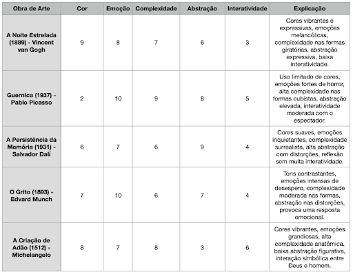

Olá Caio,

Chegamos em uma das etapas de preparação! A cada Teste de Performance (TP) você terá a oportunidade de praticar os conhecimentos adquiridos e receber feedbacks relevantes para o seu aprendizado.

Iremos testar nossa compreensão sobre os conceitos de IA Generativa, modelos de linguagem grandes (LLMs), embeddings, tokenização e desafios éticos no uso de LLMs.

### Exercício 1

Crie uma conta no Poe.com. Este serviço permite que você interaja com vários modelos de LLM. Faça um print da sua conta criada.

Observação: Lembre-se das limitações da conta gratuita:

GPT-4 e Claude: limite de 3 mensagens por dia.
Outros modelos: limite de 10 mensagens por dia no total.
Use os modelos com parcimônia para garantir que consiga concluir todos os exercícios.

### Exercício 2

Usando o serviço Poe.com, faça o seguinte prompt:

Prompt: “Descreva o funcionamento do processo de pré-treinamento de LLMs e explique a importância do conceito de embeddings em LLMs”.

Execute esse prompt nos seguintes modelos: 

 GPT-4o
 Llama-3.1-70B
 Gemini-1.5-Flash
 Claude-3-Haiku
Escreva as respostas de cada modelo e compare-as. Qual delas está mais precisa de acordo com seu conhecimento? Identifique eventuais erros ou imprecisões.

### Exercício 3

Represente 5 experiências pessoais únicas (ex.: uma viagem memorável, uma refeição favorita, um encontro importante…) em 5 dimensões: cor, emoção, complexidade, abstração e interatividade. Cada dimensão deve ser mensurada de 0 a 10. 

### Exercício 4

Identifique duas experiências semelhantes com base nos vetores descritos na questão anterior e justifique sua escolha pelo critério de similaridade entre os vetores.

### Exercício 5

Você é o curador de uma exposição de arte composta por 5 obras de diferentes estilos e temas. Cada obra foi representada por um vetor de 5 dimensões (mesmas do exercício 3) com valores de 0 a 10.

Determine:

Qual obra é mais parecida com cada uma de suas experiências em termos de emoção?
Qual obra se aproxima mais da média das suas experiências em termos de complexidade visual?

### Exercício 6

Nas últimas 3 questões você trabalhou com embeddings. Discuta como o uso de embeddings pode capturar semelhanças e diferenças em contextos subjetivos, como experiências pessoais e obras de arte. Reflita sobre a capacidade dos modelos de embeddings em capturar nuances e como isso se aplica à IA Generativa.

### Exercício 7
A empresa TechGen Solutions precisa decidir entre dois modelos de LLMs para seu sistema de interação com clientes:

GPT-4: Focado em performance robusta e processamento de texto e imagens.
LLama 2: Modelo open-source com boa performance em datasets menores.
Considerando performance, integração, custo e escalabilidade, qual modelo seria mais adequado? Justifique sua resposta.

### Exercício 8
Usando o pacote gensim e o modelo pré-treinado glove-wiki-gigaword-50, calcule a similaridade entre as seguintes frases:

s0 = "Mark zuckerberg owns the facebook company"

s1 = "Facebook company ceo is mark zuckerberg"

s2 = "Microsoft is owned by Bill gates"

s3 = "How to learn japanese"

Dica:

import gensim.downloader as api
model = api.load("glove-wiki-gigaword-50")
Use a função de distância cosine do pacote spatial (spatial.distance.cosine) para calcular as similaridades. Não esqueça de apresentar as similaridades.

### Exercício 9
Explique o que é tokenização e por que ela é fundamental no pré-processamento de textos em LLMs. Use exemplos práticos para ilustrar sua explicação.

### Exercício 10
Escolha um dos LLMs disponíveis no mercado (ex.: GPT-4, Claude, LLaMa, Gemini) e descreva três vantagens e três desvantagens de usar esse modelo em uma aplicação prática.

### Exercício 11
Desenvolva um sistema de busca de frases que utilize o modelo glove-wiki-gigaword-50 e a biblioteca gensim. Seu sistema deve permitir que o usuário forneça uma única palavra como entrada, e, com base nisso, o programa deve retornar 5 frases da base de dados, ordenadas pela similaridade com a palavra fornecida.

Banco de Dados

frases = [

"Mark Zuckerberg is the founder of Facebook.",

"Facebook is one of the largest social media platforms.",

"Bill Gates co-founded Microsoft.",

"Microsoft develops software products like Windows and Office.",

"Steve Jobs was the co-founder of Apple.",

"Apple is known for its iPhones and Mac computers.",

"Elon Musk is the CEO of SpaceX and Tesla.",

"Tesla is a leader in electric vehicles.",

"Google is a major player in the tech industry.",

"Amazon is a giant in e-commerce and cloud computing."

]

Responda: Qual a saída do seu programa para a palavra "apple"? Qual o valor de similaridade?

### Exercício 12
Avalie os desafios éticos no uso de LLMs, como questões de viés, privacidade e impactos sociais. Como essas questões podem ser mitigadas? Apresente artigos e/ou reportagens (com links) que embasam sua resposta. 

