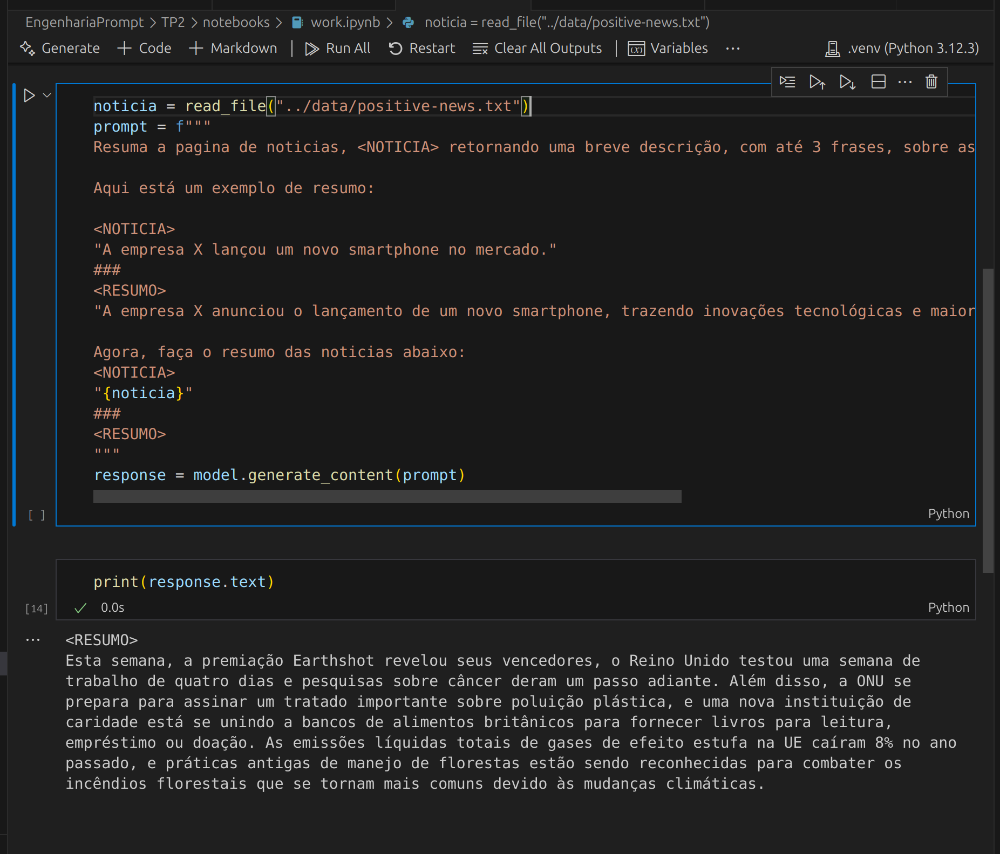

# Entrega do TP2 de Engenharia de Prompt

### Caio Serra

## Evidências

[Poe PDF](docs/POE.pdf)

[Notebook PDF](docs/notebook.pdf)


## Enunciado e Respostas

Olá Caio,

Chegamos em uma das etapas de preparação! A cada Teste de Performance (TP) você terá a oportunidade de praticar os conhecimentos adquiridos e receber feedbacks relevantes para o seu aprendizado.

Neste TP, iremos testar nossa compreensão sobre a comunicação com LLMs a partir de técnicas de Prompt Engineering.

### Orientações

- O código deve ser disponibilizado no GitHub.
- Notebooks com respostas devem ser exportados para pdf e anexados no sistema.
- Respostas usando o Poe.com devem ser enviadas como print-screens salvos num documento (google docs, word…) e exportados em pdf para submissão no sistema.
- Os aluno devem enviar 1 pdf com o notebook e 1 pdf com o documento (Poe.com)

**Avaliações Positivas**

- Código funcional, organizado, comentado e formatado.
- Códigos mantidos em repositórios Git.
- Questões discursivas serão avaliadas segundo a profundidade dos argumentos. 
- Exposição de tabelas para argumentação.
- Diagramas quando solicitados, para arquiteturas e fluxos de informação.
- Plots devem possuir título, labels, unidades dos eixos x e y, legendas e grid.

**Avaliações Negativas**

- Respostas simples para as perguntas discursivas.
- Códigos gerados por prompts.
- Plots sem capricho, não auto-explicativas.
- Desorganização do repositório Git.
- Desorganização do material enviado para avaliação.
- Envio de arquivos compactados com o repositório.
- Material enviado sem o link para o repositório Git.


### Exercício 1 - Princípios de Criação de Prompts Eficazes

Alguns princípios são essenciais para a construção de prompts claros e obtenção de respostas precisas. Identifique e explique quais princípios foram utilizados no prompt abaixo:

```
Prompt

Como um especialista em turismo, liste 3 atrações turísticas imperdíveis de Paris e forneça uma breve descrição para cada uma delas. Aqui está um exemplo do formato esperado:


###

Atração 1: Torre Eiffel

Descrição: Um dos monumentos mais icônicos do mundo, conhecido por sua estrutura de ferro e vista panorâmica da cidade.

```

> **R:** Existem diferentes princípios que falam sobre a construção de prompts eficazes em LLM. Um framework bem reconhecido é o "The Five 'S' Model" da iniciativa AI for Education. De acordo com seus cinco princípios, Set the scene, be Specifc, Simplify your language, Structure the output e Share feedback, podemos obter melhores resultados.
>
> Já, segundo Mike Taylor em seu livro, "Prompt, Engeneering for Generative AI" para a construção dos promps, os princípios são: Give Directions, Specify Format, Provide Exemples, Evaluate Quality e Divide Labor.
>
> Ambos convergem em alguns aspectos, como em fornecer riqueza de detalhes, com restrições, tom de voz, exemplos, formatos de saída e outros elementos e tecnicas.
>
> Alguns destes principios que identifiquei foram:
> 
> 1- Set the scene/Give Directions:
> 
> Ao especificar a persona do especialista em turismo
> 
> "Como um especialista em turismo,"
> 
> 2- be Specifc/Specify Format: 
>
> Definindo a quantidade e tipo de retorno esperado. 
> 
> "liste 3 atrações turísticas imperdíveis de Paris e forneça uma breve descrição para cada uma delas"
> 
> 3- Structure the output/Provide Examples: 
> 
> Exemplificou um retorno, dando especificidade ao formato da informação: 
> 
> "Atração 1: Torre Eiffel 
> 
> Descrição: Um dos monumentos mais icônicos do mundo, conhecido por sua estrutura de ferro e vista panorâmica da cidade."
>
> 4 - Simplify your language
> 
> O texto foi conciso e fez uso de linguajar simples.

### Exercício 2 - Simulação de Atendimento ao Cliente com Diferentes Personas

Vamos simular uma situação de telemarketing onde persona e tom são críticos para o sucesso da interação. Para criarmos uma base de treinamento dos operadores, simule duas respostas para o mesmo atendimento, ora com um cliente agressivo, ora com um cliente tranquilo. Crie e teste um prompt (Poe.com) para cada situação a partir do atendimento:

“Bom dia, me chamo João e lhe trago hoje uma promoção imperdível sobre a sua assinatura de internet móvel. Por mais 20 reais, consigo lhe oferecer 10GB a mais na sua franquia. Quando podemos estar agendando a sua migração?”
Descreva o comportamento do cliente nas duas situações? As respostas saíram como o esperado?

> **R:** Utilizando o Claude-3-Haiku, através do Poe.com, obtive duas respostas bem educadas e dentro do que se espera de um script de atendimento de telemarketing, mantendo a edução (mesmo com o cliente mal educado) e tentando manter a oferta da migração.
>
> Obs.: Cortei o primeiro prompt que estava incompleto e mantive todas as chamadas dentro do mesmo Chat, não sei o quanto isso influenciou nas respostas.


### Exercício 3 - Automação de Mensagens Promocionais com Princípios de Prompting

A empresa de turismo viagens.com deseja automatizar o processo de criação de envio de mensagens para clientes, informando-lhes sobre promoções recentes. Escreva um prompt que contenha os três princípios de 1) persona, 2) dados e 3) tom para gerar a mensagem automática. Execute o prompt usando a sua conta Poe.com e justifique se o LLM respondeu como esperado.

> **R:** Realizei o prompt com o modelo GPT-4o a partir do Poe.com, e obtive uma resposta dentro do esperado, fazendo uso dos dados disponibilizados, dentro da persona e no tom especificados.

### Exercício 4 - Desenvolvimento de Prompts para Recomendação de Produtos

Você está desenvolvendo um sistema de recomendações de produtos para um e-commerce. Crie dois prompts com base nos princípios de prompting, sendo o primeiro um prompt simples e o segundo um prompt com exemplos (few-shot prompting). Utilize o Poe.com para testar os prompts com um LLM, comparando os resultados gerados. Qual dos prompts foi mais eficaz e por quê?

> **R:** Fiz os prompts em inglês (para melhor uso do modelo) com o modelo Gemini-1.5-Flash através do Poe.com. No primeiro prompt fiz um 0-shot, mas com uso de outro elementos como persona, tom e direção, entretanto, a resposta não trouxe o resultado esperado. 
>
> Como mencionei uso de dados que não estão presentes no prompt, a resposta foi um pedido por tais informações (o que me surpreendeu).
>
> Após dar as informações pedidas, ele conseguiu gerar uma resposta dentro do esperado, com produtos (ficticios), descrições e racional da indicação com coerência.
>
> Depois realizei um novo prompt com a tecnica de few-shots, e modelo semelhante ao anterior, e a resposta ainda me solicitou informações não fornecidas (no caso a categoria dos produtos ou interesse do usuário), após fornece-las em novo prompt, o modelo respondeu dentro do esperado, seguindo o modelo dos exemplos.
>
> Por fim, realizei um prompt quase identico ao anterior, mas informando a categoria de interesse do cliente, e assim a resposta foi dentro do esperado, atendendo ao que foi pedido. 


### Exercício 5 - Listagem de Componentes de Computadores de Alto Desempenho

Utilize o Poe.com para criar um prompt simples que faça o LLM listar os principais componentes de um computador de alto desempenho, suas capacidades computacionais (HD, RAM, CPU, GPU…), marcas, modelos e preços. Teste o prompt e explique se o resultado atendeu às expectativas: as marcas e modelos existem? As capacidades do computador são de alto desempenho? Compare com fontes encontradas na internet.

> **R:** Fiz os prompts em inglês (para melhor uso do modelo) com o modelo Gemini-1.5-Flash através do Poe.com. A resposta foi bem aderente ao pedido, exceto pelo formato da lista no exemplo que não foi respeitado (porem ainda retornou uma lista). 
>
> Antes de retornar os dados o modelo "informou" suas restrições quanto ao pedido, as variações de componentes dos modelos, seu preço que varia de acordo e a janela de tempo ao qual ele se referiria.
>
> Todos os modelos apresentados existem de fato e suas especificações parecem dentro do que se encontra na internet, se tratando de computadores (notebooks) de alto desempenho.

### Exercício 6 - Análise dos Benefícios da Inteligência Artificial para Pequenas Empresas

Desenvolva um prompt simples para que o LLM forneça uma análise rápida sobre os benefícios de usar inteligência artificial em pequenas empresas. Qual foi o resultado gerado pelo LLM? Aplique os princípios de prompt para obter resultados mais precisos. Teste os prompts na sua conta do Poe.com e copie os prompts e respectivas saídas, junto com a explicação do que foi feito entre um prompt e outro.

> **R:** Inicialmente criei o prompt mais simples e direto com o que foi pedido (exatamente o mesmo) e embora não tenha fornecido nenhum dado extra a resposta foi relevante, listando beneficios e pontos de atenção, sem alucinações aparentes. A resposta foi generica mas verdadeira.
>
> Para o segundo prompt eu modifiquei o pedido e fizemos uso de uma persona, alem de direções mais diretas dando foco a restrição de custo de uma pequena empresa, e a resposta melhorou, com a persona sugerindo focar em ROI e dando exemplos condizentes, tanto dos usos, benefícios e seus pontos de atenção.


### Exercício 7 - Resumo de Notícia Utilizando Exemplos em Prompts

Usando a API Gemini, crie um notebook que utilize prompts para resumir uma notícia (escolha da página principal de um portal de notícias e copie no notebook). O prompt deve solicitar um resumo dessa notícia usando o princípio de Exemplos para guiar a resposta do LLM. Teste o código e avalie a qualidade do resumo gerado. 

> **R:** Extraí os titulos e descrições curtas das notícias da primeira página do portal https://www.positive.news/ e então solicitei que fosse feito um resumo (usei de exemplo o prompt da aula com algumas modificações). O prompt e a resposta foram em português (as noticias estão em inglês) e estão todos coerentes com as noticias.



### Exercício 8 - Identificação de Entidades em Notícias com LLM

Uma consultoria lhe contratou para automatizar a descoberta de pessoas mencionadas em notícias de jornal. Com base no Exercício 7, escolha 3 notícias e monte uma aplicação com um prompt para o LLM identificar menções a diferentes entidades em cada notícia (como pessoas, órgãos públicos, empresas…). Implemente um notebook para testar o código usando a API do Gemini. Descreva o prompt, seus resultados e avalie se a resposta do modelo atende às expectativas da consultoria.

> **R:** A partir das 3 noticias escolhidas, copiadas para arquivos txt, solicitei ao gemini que fizesse uma lista de toda Pessoa, Empresa ou Evento que ele encontrasse no texto, fornencendo exemplo. 
>
> A resposta foi muito boa, ele listou corretamente as figuras, mas foi alem do exemplo e classificou as listas, criando até uma lista Outros com outras entidades. O formato fugiu um pouco do especificado, mas poderia ainda ser processado por um sistema, atendendo a demanda da consultoria.


### Exercício 9 - Cálculo de Tokens em Texto Longo com API Gemini

Implemente um notebook que use a API Gemini para calcular a quantidade de tokens necessários para processar um texto de 5.000 palavras. Baseie-se no modelo de tokenização utilizado por Gemini e explique como a quantidade de tokens influencia o custo e o desempenho da interação com LLMs em textos longos.

> **R:** Após algumas tentativas consegui rodar o tokenizer do Gemini localmente e obter o resultado.
>
> O texto foi gerado através de ferramenta online e consiste em 10 paragrafos com um total de 5000 palavras em inglês.
>
> Após contagem de tokens o resultdo obtido foi de **6,341** tokens
> O numero de tokens influencia diretamente o custo e o desempenho de um LLM, pois seu modelo de custos é baseado na quantidade de tokens totais, do prompt e da resposta. 
>
> É comum se otimizar os tokens dos prompts para reduzir o custo em um ambiente produtivo.
>
> Mais tokens significam mais processamento, maior demora na reposta, o que pode influenciar a experiencia do usuário
>
> As LLMs tem limite de contexto, portanto prompts muito grandes precisam ser quebrados em prompts menores e depois agregados para obter uma resposta completa.
>
> Outro problema possivel é na qualidade da resposta, aonde em contextos muito grantes a informação pode ser diluida, podendo perder informações importantes.
>
> O ideal é que seja feito um trabalho de otimização do prompt para reduzir somente aos tokens essenciais para obter o resultado esperado.


### Exercício 10 - Otimização de Respostas com Role Prompting

No Poe.com, aplique a técnica de Role Prompting para otimizar as respostas do LLM Claude3.5. O cenário é o seguinte: você está desenvolvendo um assistente virtual para uma empresa de consultoria jurídica. Crie um prompt onde o modelo deve assumir o papel de um advogado especializado em direito contábil ao responder perguntas sobre Imposto de Renda de Pessoa Física. Avalie a resposta do modelo para uma mesma pergunta sobre IRPF num prompt com e sem Role Prompting.

> **R:** Realizei tres perguntas, que obtive de um FAQ (https://www.portaltributario.com.br/irpf/) em dois prompts, com e sem role playing.
> Ambas respostas parecem corretas; 
>
> Sem o role playing  foi mais direta em responder dando números e respostas simples, estruturadas em bullets; 
> 
> Com o Role playing a resposta se tornou muito mais técnica, fazendo referencias a artigos, leis e regulamentos de forma correta, e respondendo as questões com maior riqueza de detalhes.

### Exercício 11 - Estruturação de Prompts com Arquivo YAML

Crie um arquivo YAML que represente a estrutura:
{‘'roteiro’: {‘atenas’: ‘prompt’, ‘roma’: ‘prompt’}},


onde você deve definir dois prompts: um para listar 3 pontos turísticos de Roma, o número anual de visitantes e uma breve descrição de cada um, e outro para fazer o mesmo com Atenas. Em seguida, crie um notebook que leia esse arquivo YAML e execute os prompts usando o Gemini (uma execução por cidade no roteiro). Qual foi o resultado? Os pontos turísticos são relevantes e suas descrições são precisas? 

> **R:** O modelo respondeu aos prompts com o seguinte resultado (coloquei em uma lista cada resposta):
>
> ['## Os 3 principais pontos turísticos de Atenas, Grécia:\n\n1. **Acrópole de Atenas:**\n\n* **Número anual de visitantes:** Aproximadamente 3 milhões de pessoas por ano.\n* **Descrição:** Considerada um dos marcos mais icônicos da Grécia e do mundo, a Acrópole é um complexo de construções antigas no topo de uma colina rochosa. Inclui monumentos como o Parthenon, o Erechtheion, a Porta dos Propileus e o Templo de Atena Niké. A Acrópole oferece vistas panorâmicas da cidade e é um testemunho da grandeza da civilização grega.\n\n2. **Fórum Romano:**\n\n* **Número anual de visitantes:** Aproximadamente 2 milhões de pessoas por ano.\n* **Descrição:** O Fórum Romano é um complexo de edifícios romanos construídos no século II d.C., que foi o centro da vida pública e comercial da cidade. Inclui o Templo de Zeus Olímpico, a Biblioteca de Adriano e a Torre dos Ventos. O Fórum Romano oferece uma visão fascinante da influência romana na Grécia.\n\n3. **Museu da Acrópole:**\n\n* **Número anual de visitantes:** Aproximadamente 1,5 milhões de pessoas por ano.\n* **Descrição:** Este museu moderno abriga artefatos da Acrópole, incluindo esculturas, frisos e artefatos arquitetônicos. O museu oferece uma visão abrangente da história e da arte da Acrópole, além de fornecer contexto para os monumentos.\n\n**Observação:** Os números de visitantes são aproximados e podem variar de ano para ano. \n', '## 3 Pontos Turísticos Imperdíveis em Roma:\n\n**1. Coliseu:**\n\n* **Número anual de visitantes:** Aproximadamente 7,5 milhões de pessoas por ano. \n* **Descrição:**  O Coliseu é um anfiteatro romano construído no século I d.C., um dos monumentos mais icônicos da história. Era utilizado para espetáculos grandiosos como combates de gladiadores e caças de animais. Atualmente, oferece uma janela para o passado, permitindo aos visitantes imaginar a grandiosidade dos eventos que ali ocorriam. \n\n**2. Fórum Romano e Palatino:**\n\n* **Número anual de visitantes:** Aproximadamente 4,5 milhões de pessoas por ano.\n* **Descrição:** O Fórum Romano era o coração da vida pública e política da Roma Antiga, com templos, basílicas e mercados. O Palatino, por sua vez, era a colina onde a elite romana construiu suas casas e palácios. Juntos, esses sítios oferecem uma visão fascinante da história de Roma, desde a fundação da cidade até a era imperial.\n\n**3. Museu do Vaticano:**\n\n* **Número anual de visitantes:** Aproximadamente 6 milhões de pessoas por ano. \n* **Descrição:**  O Museu do Vaticano é um complexo de museus que abriga obras de arte e artefatos de grande valor, como as Capelas Sistina e Paulina,  pinturas de artistas renomados como Rafael e Michelangelo, além de esculturas e mosaicos. A visita ao museu culmina na Basílica de São Pedro, um monumento icônico da Igreja Católica Romana.\n\n\nÉ importante lembrar que esses são apenas alguns dos muitos pontos turísticos fascinantes que Roma oferece. A cidade possui uma riqueza cultural e histórica incomparável, com museus, igrejas, fontes e parques que encantam visitantes do mundo todo.\n']
>
> O formato não foi o melhor, porem ele listou corretamente 3 pontos turisticos relevantes, com número de visitantes e descrição coerente.

### Exercício 12 - Sistema de Envio de Emails com Dados Turísticos em JSON

Queremos montar um sistema que envie emails com os pontos turísticos de cidades num roteiro de viagem. Com base no Exercício 11, altere o prompt para estruturar a saída em formato JSON, com descrições e número de visitantes. Crie um notebook que use a biblioteca pandas para converter esse JSON para dataframe e plot um único gráfico de barras horizontais com todos os pontos turísticos, destacando as cores das barras de acordo com a cidade do ponto turístico (Coliseu, em Roma deve ter uma cor diferente que Parthenon, em Atenas). Coloque as legendas no gráfico.

> **R:** Evidências no [Notebook PDF](docs/notebook.pdf)

Assim que terminar, salve seu trabalho em PDF nomeando o arquivo conforme a regra “nome_sobrenome_DR4_TP2.PDF” e poste como resposta a este TP.